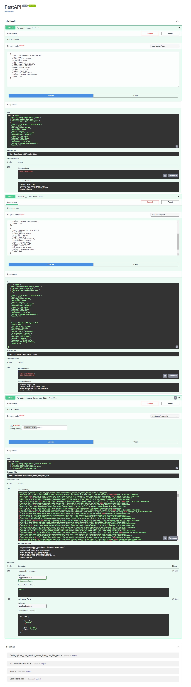

# Дз №1 по предмету Машинное обучение (ВШЭ)
Предсказание стоимости автомобиля (дз-1, Машинное обучение) 

В рамках домашнего задания был реализован сервис по предсказанию стоимости автомобиля с помощью методов линейной регрессии на основе исторических данных.
Работа включала в себя следующие этапы:
1.	 Разведочный анализ данных 
2.	 Обучение различных моделей линейной регрессии и поиск оптимальных значений гиперпараметров
3.	 Реализация сервиса на FastApi

На этапе разведочного анализа данных были обнаружены и устранены следующие моменты:
- наличие дубликатов (1159 объектов трейна имели одинаковое признаковое описание);
- признаки mileage, engine, max_power имели строковое представление и были преобразованы в числовые (удалены единицы измерения);
-  обнаружены пропуски в  ряде признаков: mileage, engine, max_power, torque и seats в трейне и тесте.  Было решено заполнять их соответствующими медианами трейна. Признак torque удален.
- Категориальные признаки были закодированы с помощью OneHotEncoder.

 На этапе обучения различных моделей линейной регрессии были получены следующие результаты:
- при обучении на вещественных признаках классическая модель линейной регрессии LinearRegression показала не очень высокое качество (значение на трейне R^2 = ~ 0.59);
- масштабирование признаков и добавление L1- регуляризации (с параметрами по умолчанию) не изменило качество модели;
- применение кросс-валидации и использование GridSearch для поиска оптимальных значений гиперпараметров для Lasso занулил некоторые веса модели, но и ухудшид ее качество (значение на трейне R^2 = ~ 0.56);
- применение кросс-валидации и использование GridSearch для поиска оптимальных значений гиперпараметров для ElasticNet также не улучшил ее качество (значение на трейне R^2 = ~ 0.56);
- Добавление в модель категориальных признаков с использование one hot encoding и подбор гиперпараметра alpha для Ridge-регрессии позволило улучшить качество (R^2 = ~ 0.61 для трейна)

Для улучшения качества модели было решено сделать следующее:
- добавить новый признак = количество лошадиных сил на литр объема двигателя;
- добавить признак – марка автомобиля;
- изменить категориальный признак owner на числовой (число владельцев);
- удалить объекты с выбросами в значениях  year, km_driven, а также с выбросами целевой переменной;
- было отмечено, что распределение целевой переменной – цена машины смещено влево, поэтому решено применить логарифмирование с целью получения распределения, близкого к нормальному.
Данные изменения помогли существенно улучшить качество модели. Подбор гипепараметра alpha для Ridge-регрессии по сетке с кросс-валидацией по 10- фолдам  получена модель, качество которой существенно улучшилось (R^2 = ~ 0.92 для теста).

Бизнес-метрика метрика (доля предсказаний, отличающихся от реальных цен на авто не более чем на 10%) оказалась не столь хорошей – 0,374 (37,4%). Это говорит о том, что для бизнеса найденная модель, может оказаться не очень привлекательной и возникнет необходимость в поиске более оптимального решения для задач бизнеса.

## Разработка сервиса на FastApi
Разработан сервис на FastApi на базе лучшей из обученных моделей линейной регрессии. Сервис позволяет осуществлять предсказание цены автомобилей по их признаковому описанию. 

Сервис имеет три endpoint-а:
/predict_item – по признакам одного автомобиля предсказывается его цена;
/predict_items - по признакам входного набора автомобилей предсказываются их цены;
/upload_csv – данные об автомобилях загружаются в виде csv-файла. Сервис возвращает исходный csv-файл, дополненный столбцом со значениями предсказаний.

Файлы:
main.py - реализация API на FastApi;
api_models/models.py -  Pydantic-модели;
models/model.py - класс MLModel, подготовка переданных признаков и предсказание значений целевой переменной с помощью обученной модели линейной регрессии;
ml_models/*.pickle - сериализованные объекты (SimpleImputer, StandardScaler, OneHotEncoder, Ridge), подготовленные предварительно на трейне.

Пример работы сервиса:

